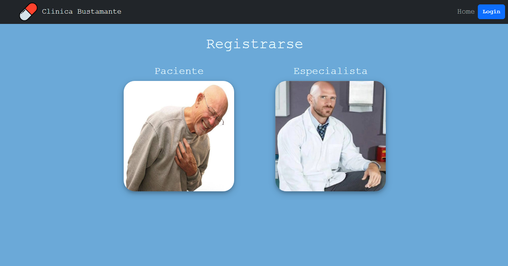
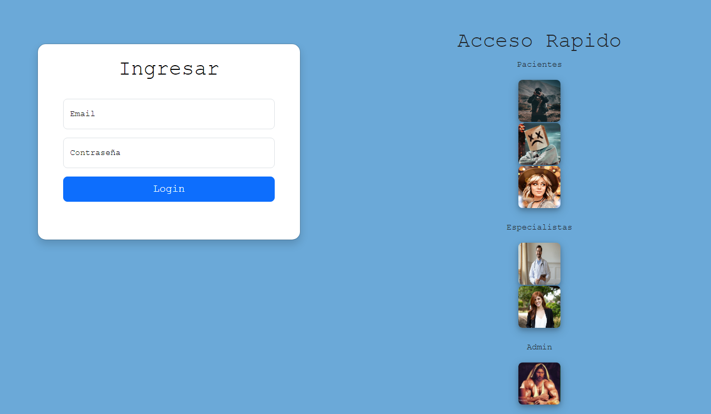

# Clinica

Esta es una aplicación intuitiva y eficiente diseñada para simplificar la gestión de turnos de pacientes y especialistas en un entorno hospitalario. Tanto los pacientes como los especialistas pueden programar y gestionar fácilmente sus citas médicas, lo que garantiza un flujo de trabajo organizado y una experiencia fluida para todos los involucrados. Desde la comodidad de su dispositivo móvil, los usuarios pueden acceder a la aplicación, seleccionar al especialista de su elección y reservar una cita en el horario que mejor se adapte a sus necesidades. 

Al ingresar el usuario será recibido con 2 opciones para crear un usuario cliente o especialista. Si este ya posee una cuenta podrá ingresar pulsando el botón "Login" en la esquina superior derecha.

Para su practicidad se encuentran 6 usuarios que el usuario puede elegir para ingresar y probar la aplicación rapidamente como otro tipo de usuario.

